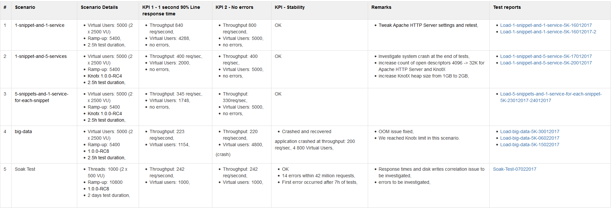

# Performance Tests Summary

## Introduction
This page gathers all tests summaries, recommendations and actions undertaken.

## Overview
* Throughput of Knot.x varies from **223 requests/sec** up to **840 requests/second** for different scenarios for **1 second response time**.
* Knot.x is stable.
* Knot.x recovers after crashes.
* [[Several fixes applied to Knot.x as well as configuration tweaks both for Knot.x and Apache HTTP Server|PerformanceTestsTuning]]

## Tests Summary

(click to view details)